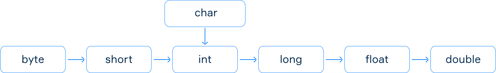
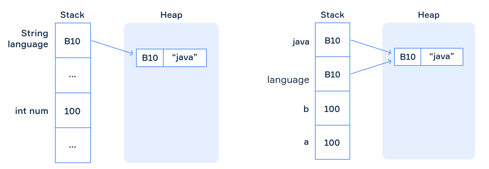

# Java 16 - 34

### Conditional Statements

Allows a program to perform different computations depending on the value of the Boolean - if true execute first, otherwise execute second

```java
if (expression) {    
    // do something
} else {
    // do something else
}
```

If the expression is `true`, then the first code block is executed; otherwise, the second code block is executed, but not both together.

```java
if (expression0) {
    // do something
} else if (expression1) {
    // do something else 1
// ...
} else if (expressionN) {
    // do something else N
} else {
    // in all other cases
}
```

A conditional statement with multiple branches creates a decision tree - nodes = Boolean expressions, branches marked true/false

**************************Control Flow************************** - the order in which various parts of a program are executed.

### Ternary Operator

AKA Conditional Operator - evaluates a condition and chooses one of two cases to execute, can be considered it as a form of a `if-else` statement.

```java
//Conditional Statement
int a = ...;
int b = ...;
int max = ...;

if (a > b) {
    max = a;
} else {
    max = b;
}

//Ternary Operator equivalent
int max = a > b ? a : b;
```

General syntax: `result = condition ? trueCase : elseCase;`

Examples:

```java
int num = ...;  // it's initialized by a value
System.out.println(num % 2 == 0 ? "even" : "odd");

int a = ...; // it's initialized by a value
int b = ...; // it's initialized by a value
String result = a == b ? "equal" : //print equal if true
                a > b ? "more" : "less"; //if false, move to next ternary operator
```

### Increment/Decrement

Increment `n++`  == `n += 1`

Decrement `n--` == `n -= 1`

- Prefix form: `++n` or `--n` increases or decreases the value of a variable before it is used;
- Postfix form: `n++` or `n--` increases or decreases the value of a variable after it is used.

Examples:

In Java, the postfix operator has higher precedence than the assignment operator. However, it returns the original value of `a`, not the incremented one. That's why when we assign `a++` to `b`, we actually assign 4, and then variable `a` is incremented.

```java
int a = 4;
int b = a++;

System.out.println(a); // 5
System.out.println(b); // 4
```

---

### While + Do-While Loops

**While loop** - aka pre-test loop since it checks the condition before the code is executed - repetitive conditional statement.

If the condition is true, execute the code. This repeats until the condition is false, and the program moves onto the next line/step.

```java
int i = 0;
while (i < 5) {
    System.out.println(i);
    i++;
}
```

```java
public class WhileDemo {

    public static void main(String[] args) {
        char letter = 'A';
        while (letter <= 'Z') {
            System.out.print(letter);
            letter++;
        }
    }
}
```

**do - while loop** - aka post-test loop since the condition is checked after the block is executed. exit condition loop = code is always run at least once.

If true, the block is executed again until the condition is false.

```java
do {
    // body: do something
} while (condition);
```

```java
public class DoWhileDemo {

    public static void main(String[] args) {
        Scanner scanner = new Scanner(System.in);

        int value;
        do {
            value = scanner.nextInt();
            System.out.println(value);
        } while (value != 0);
    }
}
```

Use a while loop to read a sequence of unknown length - invoke the `.hasNextInt()` method of the Scanner class - returns true if next element is an `int` otherwise false.

```java
Scanner scanner = new Scanner(System.in);

int sum = 0;
while (scanner.hasNextInt()) {
    int elem = scanner.nextInt();
    sum += elem;
}

System.out.println(sum);
```

Use `.hasNext()` method to check the input is over.

### For Loop

use to iterate over a range of values or through an array if number of iterations/range borders are known, otherwise use a while loop.

```java
for (initialization; condition; modification) {
    // do something}
```

- the **initialization statement** - executed once before the loop begins; usually, loop variables are initialized here;
- the **condition** - a Boolean expression that determines the need for the next iteration; if it's `false`, the loop terminates;
- the **modification -** a statement that changes the value of the loop variables; invoked after each iteration; usually, it uses **increment or decrement** to modify the loop's variable.
1. the initialization statement;
2. if the condition is `false` then terminate the loop; if the condition is `true`, then the loop's body is executed;
3. the modification is performed;
4. go to stage 2 (condition).

```java
int n = 9;
for (int i = 0; i <= n; i++) {
    System.out.print(i + " "); // here, a space is used to separate numbers}
```

```java
int startIncl = 1, endExcl = 11;

int sum = 0;
for (int i = startIncl; i < endExcl; i++) {
    sum += i;
}

System.out.println(sum); // it prints "55"
```

The initialization statement, the condition, and the modification parts are optional.

- can declare outside the loop

```java
int i = 10;
for (; i > 0; i--) {
    System.out.print(i + " ");
}
```

- can write an infinite loop

```java
for (;;) {
    // do something}
```

**Nested Loops**

```java
for (int i = 1; i < 10; i++) {
    for (int j = 1; j < 10; j++) {
        System.out.print(i * j + "\t");
    }
    System.out.println();
}
```

### Branching statements

The ******************************break statement****************************** - terminate the current loop or terminate a case in a switch statement.

- terminates the loop in which it is located. If in a nested loop, the outer loop won’t be stopped.

```java
boolean stopped = false;
for (int i = 0; i < 10 && !stopped; i++) {
    for (int j = 0; j < 10; j++) {
        System.out.print(j + " ");
        if (i == j) {
            stopped = true;
            break;
        }
     }
    System.out.println();
}
```

The ************************continue statement************************ - skip the current iteration and go to the next one in the loop - cannot skip the current iteration of the outer loop.

- for loop: continue causes control to move to increment/decrement statement.
- while/do-while loop: control moves to condition.

```java
int n = 10;
for (int i = 0; i < n; i++) {
    if (i % 2 != 0) {
        continue;
    }
    System.out.print(i + " ");
}
for (int i = 0; i < n; i++) { 
    if (i % 2 == 0) {
        System.out.print(i + " ");
    } 
}
```

### Switch statement

Way to choose between multiple cases based on the value of a single variable (not an expression).

```java
switch (variable) {
    case value1:        // do something here        
				break;
    case value2:        // do something here
        break;
    //... 
    case valueN:        // do something here
        break;
    default:        // do something by default
			  break; // it can be omitted}
```

******************required****************** - `switch` and `case` keywords. ****************optional**************** - `break` and `default` keywords. 

- break stops the execution of the whole statement
- if case doesn’t have a break, the following case will be executed too.

---

### Binary

language of 0 and 1 - smallest = 1bit(b); 8bits = 1byte(B)

| SI metric | Symbol | Powers of ten |
| --- | --- | --- |
| Kilobyte | kB | 10^3 B (1000 B) |
| Megabyte | MB | 10^6 B (1000 kB) |
| Gigabyte | GB | 10^9 B (1000 MB) |
| Terabyte | TB | 10^12 B (1000 GB) |
| Petabyte | PB | 10^15 B (1000 TB) |

### Sizes and ranges

primitive types - cannot be broken down into smaller components

**Integers**: `long` L, ⁣`int`, `short`, and `byte`(from the largest to the smallest).

- `byte`: size 8 bits (1 byte), ranging from −128 to 127;
- `short`: size 16 bits (2 bytes), ranging from −32768 to 32767;
- `int`: size 32 bits (4 bytes), ranging from −(2^31) to (2^31)−1;
- `long`: size 64 bits (8 bytes), ranging from −(2^63) to (2^63)−1.

******************Floating-point****************** - `double` (64 bits, ~14-16 decimal digits) and `float` f (32 bits, ~6-7 decimal digits).

********************Characters******************** - `char` to represent letters (uppercase and lowercase), digits, and other symbols. Each character is just a single symbol enclosed in single quotes. This type has the same size as the `short` type (2 bytes = 16 bits).

****************Boolean**************** - can store only two values: `true` and `false`.

### Type Casting

Used to assign a value of one type to a variable of another type.



**Implicit casting** - performed automatically by the Java compiler when the target type is wider than the source type.

- can cast left to right, but not right to left.
- can result in some information lost.
- converting a char to int returns the ASCII value for the char. `char ch = '?';` `int code = ch; // 63`

**Explicit casting** - write the target type in parentheses before the source. `(targetType) source`

- may lose information about the overall magnitude of a numeric value and may also lose precision.

```java
double d = 2.00003;

// it loses the fractional part
long l =  (long) d; // 2
// requires explicit casting because long is wider than int
int i = (int) l; // 2 
// requires explicit casting because the result is long (indicated by L)
int val = (int) (3 + 2L); // 5
// casting from a long literal to char
char ch = (char) 55L; // '7'
```

- may truncate the value

```java
long bigNum = 100_000_000_000_000L;
int n = (int) bigNum; // 276447232
```

### Calling a Method

A method is a sequence of statements that can be invoked or referred to by its name - requires a **legal identifier**: case-sensitive, include Unicode letters, digits, underscore `_` or currency characters, can't start with a digit, must not be a keyword.

To call (or invoke) a method in your program, you should write its name and pass the values of its parameters in parentheses.

`Math.round()` - rounds to nearest int

`.toLowerCase()` - decapitalise letters

`isLetter()` - determines if the specified character is a letter.

`compareTo()` - compares two strings lexicographically, i.e. based on the Unicode value of each character in the strings.

### Declaring a Method

A method is always located inside a **class**. It contains a **set of modifiers**, a **type of the return value**, a **name**, ****a list of **parameters** in parentheses `()` , and a **body** in curly brackets `{}`. The combination of the name of the method and the list of its parameters is known as a method **signature**.

```java
public static returnType methodName(parameters) {
		body
}
```

- **modifiers**:
    - **access modifiers**: define the visibility of the method, e.g. `public` = no restrictions for invoking the method even from other classes.
    - **non-access modifiers**: provide information about the behaviour of methods to JVM
        - `static` method = it belongs to the class and can be accessed without creating any object.
        - `instance` method = can be invoked only through or with an object or instance of this class.
- **type of the return value**, a **name**, ****a list of **parameters**: defined in the `()` and reflects how they will be passed to the method when it is invoked.
    - non-parameterized: methods that don’t have parameters.
    - use void to indicate no value to return

```java
public static void methodName(parameters) {
		System.out.println("body");
} // this method just prints the line, so it returns no value

public static void methodName(String s, int i) {
		if (num > 0) System.out.println("the number is positive");
	  else return; //use return to exit the method
}
```

NOTE: When you pass a variable of a primitive type to a method, a copy of this variable is created with the same value. Inside a method, only this copy is processed. Any changes to this copy will not affect the variable that was passed.

---

### The Main Method

Java is a OOP language = every Java program can be considered as a collection of objects. 

The main method is the entry point for any application. The class can have any name but the method must be called `main`.

`public static void main(String[] args)`

- `public` indicates that the method can be invoked from everywhere;
- `static` indicates the method can be invoked without creating an instance of the class;
- `void` indicates the method doesn't return any value;
- the array variable `args` contains arguments entered at the command line, the array is empty if there are no arguments.

If invalid, an error happens at runtime:

- program cannot be compiled - the main method declaration breaks the syntax of Java (i.e. no return value, mistake in spelling)
- or is successfully compiled but cannot be started - doesn't satisfy the specific requirement of the main method (i.e. invalid args [], no static keyword)

Compile-Time Error = When you have errors in your syntax (ex. no semicolon)
Runtime Error = When you have errors in your logic (ex. division by zero)

### Functional Decomposition

The approach of dividing a complex program into subroutines, to make it less specific and more flexible.

- can easily test separate components since they are defined in separate methods and makes it easier to support the program in the future.

see [ Example: Functional Decomposition](https://www.notion.so/Example-Functional-Decomposition-96bd0d6be0e34208a2e9804057bebfb7?pvs=21) 

### Overloading

**Method overloading** is a programming concept that allows you to design methods that share the same name but have distinct arguments.

When a method is called, the language determines which version to run based on the number, types, and order of the arguments given. With method overloading,

If methods have the same name, but a different number or type of parameters, they are **overloaded**. 

`public int sum(int a, int b)`: signature = `sum(int a, int b)` - Method signatures are used to distinguish between methods with the same name.

- When a method is called, the compiler compares its signature to the method signature of the method specification so as to identify which method was called.
- Note that in the case where methods have the same types of parameters, changing the order of these parameters is a valid case of overloading.
- In the case where the method parameter type is not exactly the same as the type of the passed argument, the compiler chooses the method that has the closest argument type in order of implicit casting.
- example: by default, assumes it’s an int

### Primitive/Reference Types

**Primitive Types** - 8 built-in types as keywords, all lowercase - int, byte, short, long, float, double, boolean and char. These aren't considered objects and represent raw values.

**Reference Types** - data types that contain references/addresses of dynamically created objects. They are not predefined like primitive data types. E.g. class types − points to an object of a class (String), array types − points to an array, interface types − points to an object of a class which implements an interface.

The String class represents character strings. All string literals in Java programs, such as "abc" , are implemented as instances of this class.

The ******new****** keyword - an object of a reference type can be created using the `new` keyword. When we use the `new` keyword, the memory is allocated for the object we create - This is called “instantiation of the object” because we create an instance of it; Then we initialize the variable by assigning some value to it.

```java
String language = new String("java"); //instantiation of String and initialization with "java"
String language = "java"; // or use a literal
```

**Main difference** - primitive vs reference: a variable of a primitive type stores the actual values, whereas a variable of a reference type stores an address in memory (reference) where the data is located.

There are two main memory spaces: **stack** and **heap**. All values of primitive types are stored in stack memory, but variables of reference types store addresses of objects located in heap memory.

**Assignment**: The way to store data also affects the mechanism to assign the value of a variable to another variable:

- primitive types: the value is just copied;
- reference types: the address to the value is copied (the data is shared between several variables) - copy of a reference rather than the value itself.

The variable `b` has a copy of the value stored in the variable `a`. But the variables `language` and `java` reference the same value, rather than copying it. 

```java
int a = 100;
int b = a; // 100 is copied to b
String language = new String("java");
String java = language;
```



************Comparisons************: Comparing reference types using `==` and `!=` is not the same as comparing primitive types. E.g. when comparing two `String` variables, it compares references (addresses) rather than actual values.

```java
String s1 = new String("java");
String s2 = new String("java");
String s3 = s2;

System.out.println(s1 == s2); // false
System.out.println(s2 == s3); // true
```


So, you should not use comparison operators when you want to compare the values. The correct way to compare content is to invoke the special method `equals`.

```java
String s1 = new String("java");
String s2 = new String("java");
String s3 = s2;

System.out.println(s1.equals(s2)); // true
System.out.println(s2.equals(s3)); // true
```

******************Null type****************** - a variable of a reference type can refer to a special `null` value that represents the fact that it is not initialized yet or doesn't have a value.

 

```java
String str = null;
System.out.println(str); // nullstr = "hello";
System.out.println(str); // hello
int n = null; // it won't compile
```

### Array

A collection of elements of the same type:

- an array is a reference type;
- all array elements are stored in the memory sequentially;
- the possible number of elements is established when the array is created and cannot be changed. But a stored element can be modified at any time.
- each element of the array is accessed by its numerical index, the first element has the **index 0**; the last element is accessed by the index equal to **array size – 1**;
- it is possible to create an array to store elements of any type.
- the size of an array cannot be greater than `Integer.MAX_VALUE`.
- By default, an array of a primitive type is initialized with default values.

To create an array filled with elements we need to:

- declare a variable of an array type **(declaration)** - we define its type and name; ****
    
    `int[] array;`  or `int array[];`
    
- create an instance of the array object **(instantiation)** - happens when memory is allocated for this object;
- and initialize the array by some values **(initialization)** - put certain values of the array object into the memory of our program - should have all elements at the moment of creation.

Enumerate all its elements: `int[] numbers = { 1, 2, 3, 4 };`

OR Initialize using variables: `int a = 1, b = 2, c = 3, d = 4;` `int[] numbers = { a, b, c, d }`

OR Use the ********new******** keyword: useful when the number of elements is known before starting the program. When we create an instance of the array object with indicated length like `[n]` or `[5]` and don't enumerate its elements explicitly, the array is initialized with default values of its type. Now, the array has `n` elements. Each element is equal to zero (the default value of the type `int`).

```java
int n = ...; // n is a length of an array
int[] numbers = new int[n];
```

Can separate declaration and instantiation into two lines:

```java
int[] numbers; // declaration
numbers = new int[n]; // instantiation and initialization with default values
```

Can write the keyword `new` and enumerate all elements of an array:

```java
float[] floatNumbers; // declaration 
floatNumbers = new float[] { 1.02f, 0.03f, 4f }; // instantiation and initialization
```

By default, an array of a primitive type is initialized with default values. For other values, you need to fill values explicitly or use the utility class Arrays. 

```java
int size = 10;
char[] characters = new char[size];

// It takes an array, start index, end index (exclusive) and the value for filling the array
Arrays.fill(characters, 0, size / 2, 'A'); // index 0 to 4
Arrays.fill(characters, size / 2, size, 'B'); // index 5 to 9

System.out.println(Arrays.toString(characters)); // it prints [A, A, A, A, A, B, B, B, B, B]
```

********************************length of an array******************************** - use `arrayName.length`

******************************access elements****************************** - use the index to set a value of the array or to get a value from it.

- set the value: `array[index] = val;`
- get the value: `val = array[index];`
- If we try to access a non-existing element by an index then a runtime exception occurs.

```java
int[] numbers = new int[3]; // numbers: [0, 0, 0]
numbers[0] = 1; // numbers: [1, 0, 0]
numbers[1] = 2; // numbers: [1, 2, 0]
numbers[2] = numbers[0] + numbers[1]; // numbers: [1, 2, 3]
int elem = numbers[3]; // throws an ArrayIndexOutOfBoundsException.
```

### Arrays as parameters

A method can have parameters of any types including arrays, strings, primitive types, and so on.

A parameter of an array type looks like a primitive type parameter. When you pass a value of a primitive type to a method, a copy of the value is created. But when you pass an array to a method, a copy of the reference is created, but the value is the same. It means that if you change the actual value (elements of an array) in the body of a method, you will see these changes outside the method.

Example: swap first and last elements of its parameter

```java
public static void swapFirstAndLastElements(int[] nums) { // nums is an array    
		if (nums.length < 1) {
        return; // it returns nothing, i.e. just exits the method    
		}

    int temp = nums[nums.length - 1]; // save the last element in a temporary local variable    
		nums[nums.length - 1] = nums[0];  // now, the last element becomes the first    
		nums[0] = temp;                   // now, the first element becomes the former last
}

public static void main(String[] args) {
    int[] numbers = { 1, 2, 3, 4, 5 }; // numbers

    System.out.println(Arrays.toString(numbers)); // before swapping - [1, 2, 3, 4, 5]
    swapFirstAndLastElements(numbers); // swapping
    System.out.println(Arrays.toString(numbers)); // after swapping - [5, 2, 3, 4, 1]
}
```

`vararg` ********************(variable-length arguments)******************** - special syntax to pass an arbitrary number of the same type of arguments to a method, specified by three dots after the type.

Example: take an int `vararg` parameter and outputs the number of arguments in the standard output using the **length** property of arrays.

```java
public static void printNumberOfArguments(int... numbers) { //a special syntax ... is used here to specify a vararg parameter.
    System.out.println(numbers.length);
}

printNumberOfArguments(1); // 1
printNumberOfArguments(1, 2); // 2
printNumberOfArguments(1, 2, 3); // 3
printNumberOfArguments(new int[] { }); // no arguments here - 0
printNumberOfArguments(new int[] { 1, 2 }); // 2
```

If a method has more than one parameter, the `vararg` parameter must be the last one in the declaration of the method.

WRONG: `public static void method(double... varargs, int a) { /* do something */ }`

CORRECT: `public static void method(int a, double... varargs) { /* do something */ }`

### Iterating over Arrays

**Processing arrays** - The `length` property of an array can help us avoid an `ArrayIndexOutOfBoundsException`.

Example: fill an array with squares of the indices of its elements

```java
int n = 10; // the size of an array
int[] squares = new int[n]; // creating an array with the specified size
System.out.println(Arrays.toString(squares)); // [0, 0, 0, 0, 0, 0, 0, 0, 0, 0]

/* iterating over the array */
for (int i = 0; i < squares.length; i++) {
    squares[i] = i * i; // set the value by the element index 
}

System.out.println(Arrays.toString(squares)); // [0, 1, 4, 9, 16, 25, 36, 49, 64, 81]
```

Example: check order of elements

```java
int[] numbers = { 1, 2, 3, 4, 5, 10, 6 }; // the order is broken
boolean broken = false; // suppose the array is well-ordered

/* iterating over the array */
for (int i = 1; i < numbers.length; i++) {
    if (numbers[i] < numbers[i - 1]) { // if the order is broken        
				broken = true; // write a result        
				break;         // terminate the loop    
		}
}

if (broken) {
    System.out.println("BROKEN");
} else {
    System.out.println("OK");
}
```

**Reading an array** - use loops to read all the elements of an array from the standard input.

Example: We have 2 inputs

```java
5 // length of the array
101 102 504 302 881 // elements of array
```

```java
Scanner scanner = new Scanner(System.in);

int len = scanner.nextInt(); // reading a length
int[] array = new int[len];  // creating an array with the specified length
for (int i = 0; i < len; i++) {
    array[i] = scanner.nextInt(); // read the next number of the array
}

System.out.println(Arrays.toString(array)); // output the array - [101, 102, 504, 302, 881]
```

F**or-each loop** - used to iterate through each element of an array, a string, or a collection without indices

```java
for (type var : array) { /*statements using var **/ } // for each element var of type type in the array array do { some statements in the body }.
```

`type` specifies the type of variable that will store one element of the array in each iteration - the type of the elements stored in the array. 

`var` is the name of that variable - remember to stick to variable naming conventions. 

Example: calculate the number of `‘a’` letters in a given character array using a For-Each loop and a For loop.

```java
char[] characters = { 'a', 'b', 'c', 'a', 'b', 'c', 'a' };

int counterForEach = 0;
for (char ch : characters) {
    if (ch == 'a') {
        counterForEach++;
    }
}
System.out.println(counterForEach); // it outputs "3"

int counterFor = 0;
for (int i = 0; i < characters.length; i++) {
    if (characters[i] == 'a') {
        counterFor++;
    }
}
System.out.println(counterFor); // it outputs "3"
```

- Cannot use it to modify an array, because the variable we use for iterations doesn't store the array element itself, only its copy.
- It is impossible to obtain an element by its index since we have no index - allows you to avoid the `ArrayIndexOutOfBoundsException`
- Cannot move through an array with more than one step per iteration: we iterate over each and every element, so we work with them one by one.