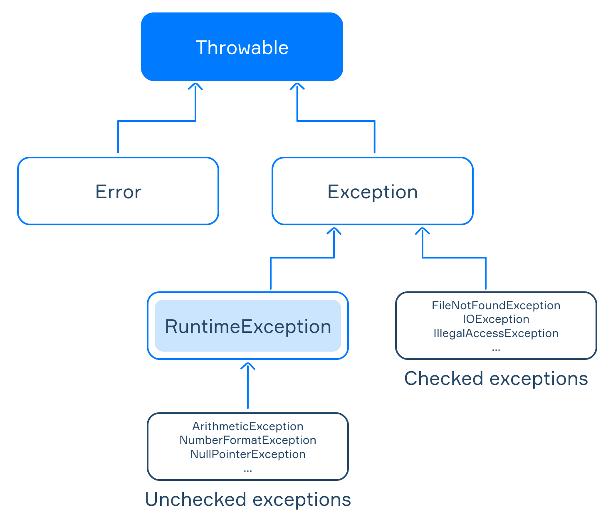

# Java 56 - 64

### Referencing Subclass Objects

1. Use subclass reference - create instances of the subclasses using the constructor:
2. Use superclass reference - use a reference variable of the parent to refer to any child object derived from that parent (because a child is a special case of the parent class).

Example: All have default no args constructor

```java
class Person {

    protected String name;
    protected int yearOfBirth;
    protected String address;

    // public getters and setters for all fields}
```

1. Use subclass reference:

```java
Person person = new Person(); // the reference is Person, the object is Person
Client client = new Client(); 
Employee employee = new Employee();
```

```java
class Client extends Person {

    protected String contractNumber;
    protected boolean gold;

    // public getters and setters for all fields}

class Employee extends Person {

    protected Date startDate;
    protected Long salary;

    // public getters and setters for all fields}
```

1. use superclass reference - the references have the type of the superclass and the actual types of created objects are subclasses.

```java
Person client = new Client(); // the reference is Person, the object is Client
Person employee = new Employee(); // the reference is Person, the object is Employee
```

- you cannot assign an object of one subclass to a reference of another subclass because they don't inherit each other: `Client whoIsIt = new Employee();` is impossible
- you cannot assign an object of the parent class to the reference of its subclass: `Client client = new Person();` is impossible too

Recall - each subclass object is an object of its superclass but not vice versa.

Problem with #2 - cannot access subclass methods through the superclass reference, i.e. here you cannot do `employee.setSalary(30000);` Can only access the references methods.

Can cast a subclass object to its superclass if object is an instance of the subclass = `Person person = new Client();` `Client clientAgain = (Client) person;` is okay. But `Employee employee = (Employee) person;` is not. Then can access subclass-specific members, otherwise a `ClassCastException` will be thrown. 

When to use superclass reference: processing an array of different types from same hierarchy, or a method that accepts an object of the base class and works with subclass objects.

Example: 

```java
public static void printNames(Person[] persons) {
    for (Person person : persons) {
        System.out.println(person.getName());
    }
}
```

```java
Ginger R. Lee
Pauline E. Morgan
Lawrence V. Jones
```

```java
Person person = new Employee();
person.setName("Ginger R. Lee");

Client client = new Client();
client.setName("Pauline E. Morgan");

Employee employee = new Employee();
employee.setName("Lawrence V. Jones");

Person[] persons = {person, client, employee};

printNames(persons);
```

If class A is a superclass of class B and class B is a superclass of class C then a variable of class A can reference any object derived from that class (for instance, objects of the class B and the class C). This is possible because each subclass object is an object of its superclass but not vice versa.

### Multiple Constructors

A class can have several constructors that assign values to the fields in different ways.

**********************************************Constructor Overloading********************************************** - when a class contains multiple constructors

- can define as many constructors as you want, each named the same as the class name but with different parameters.

Example:

The class `Robot` has two constructors:

- `Robot()` is a no-argument constructor that initializes fields with default values;
- `Robot(String name, String model)` takes two parameters and assigns them to the corresponding fields.

To create an instance of the class `Robot` we can use either of the two constructors:

```java
Robot anonymous = new Robot(); //name: "Anonymous", model: "Unknown"
Robot andrew = new Robot("Andrew", "NDR-114"); //name: "Andrew", model: "NDR-114"
```

```java
public class Robot {
    String name;
    String model;

    public Robot() {
        this.name = "Anonymous";
        this.model = "Unknown";
    }

    public Robot(String name, String model) {
        this.name = name;
        this.model = model;
    }
}
```

Invoke a constructor from another - can initialize one part of an object by one constructor and another part by another constructor.

- use `this();` - calls a no-argument constructor or input parameters to call a different constructor.

```java
public class Robot {
    String name;
    String model;
    int lifetime;

    public Robot() {
        this.name = "Anonymous";
        this.model = "Unknown";
    }

    public Robot(String name, String model) {
        this(name, model, 20);
    }

    public Robot(String name, String model, int lifetime) {
        this.name = name;
        this.model = model;
        this.lifetime = lifetime;
				System.out.println("The third constructor is invoked");
    }
}
```

Now, the class has three constructors:

- `Robot()` is a no-argument constructor;
- `Robot(String name, String model)` is a two-argument constructor that invokes another constructor;
- `Robot(String name, String model, int lifetime)` is a three-argument constructor that fills all fields

The second invokes the third, passing `name`, `model`, and `lifetime = 20` to it.

The third initialises all fields of the object.

So running this `Robot andrew = new Robot("Andrew", "NDR-114");` outputs this `The third constructor is invoked` .

### The keyword `super`

To access members or constructors of the superclass, use a special keyword `super`. This keyword can be used in several cases: to access instance fields of the parent class; to invoke methods of the parent class; to invoke constructors of the parent class (no-arg or parameterized).

************To Access superclass fields/methods************ - similar to `this`, but it refers to the immediate parent class object. It is optional if members of a subclass have different names from members of the superclass. Otherwise, using `super` is the right way to access hidden (with the same name) members of the base class.

```java
class SuperClass {

    protected int field;

    protected int getField() {return field;}

    protected void printBaseValue() {
        System.out.println(field);
    }
}
```

In `SubClass()` the superclass field is initialised using `super` because the subclass field hides the base class fields with the same name.

In `printSubValue` the superclass method is invoked - `super` is optional, it is only required when the subclass method has the same name.

```java
class SubClass extends SuperClass {

    protected int field;

    public SubClass() {
        this.field = 30;  // It initializes the field of SubClass        
				field = 30;       // It also initializes the field of SubClass        
				super.field = 20; // It initializes the field of SuperClass    }

/** It prints the value of SuperClass and then the value of SubClass     */    
		public void printSubValue() {
		    super.printBaseValue(); //invokes the method of SuperClass, super is optional here        
				System.out.println(field);
		}
}
```

****************Invoke superclass constructor****************

Constructors are not inherited but a superclass constructor can be invoked from a subclass using  `super()`. We can also pass some arguments to the superclass constructor.

- Invoking `super(...)` must be the first statement in a subclass constructor, otherwise, the code cannot be compiled;
- The default constructor of a subclass automatically calls the no-argument constructor of the superclass.

```java
class Person {

    protected String name;
    protected int yearOfBirth;
    protected String address;

    public Person(String name, int yearOfBirth, String address) {
        this.name = name;
        this.yearOfBirth = yearOfBirth;
        this.address = address;
    }

    // getters and setters}
```

```java
class Employee extends Person {

    protected Date startDate;
    protected Long salary;

    public Employee(String name, int yearOfBirth, String address, Date startDate, 
										Long salary) {
        super(name, yearOfBirth, address); // invoking a constructor of the superclass
        this.startDate = startDate;
        this.salary = salary;
    }

    // getters and setters}
```

Here, each class has a constructor to initialize fields and the constructor of `Employee` invokes the parent class constructor to assign values to the passed fields. 

### Hierarchy of Exceptions

`java.lang.Throwable` - the base class for all exceptions - it provides a set of common methods for all exceptions:

- `String getMessage()` returns the detailed string message of this exception object;
- `Throwable getCause()` returns the cause of this exception or `null` if the cause is non-existent or unknown;
- `printStackTrace()` prints the stack trace on the standard error stream.

The `Throwable` class has two direct subclasses: `java.lang.Error` and `java.lang.Exception`.

- subclasses of the Error class represent low-level exceptions in the JVM, for example:  `OutOfMemoryError`,  `StackOverflowError`;
- subclasses of the Exception class deal with exceptional events inside applications, such as:  `RuntimeException`,  `IOException`;
- the `RuntimeException` class is a rather special subclass of Exception. It represents so-called **unchecked** exceptions, including: `ArithmeticException`, `NumberFormatException`, `NullPointerException`.



********************************Checked and Unchecked Exceptions********************************

1. Checked - represented by the Exceptions class, excluding Runtime Exception class - compiler checks if the occurrence of such exceptions in a program is expected or not.
    
    If a method throws a checked exception, this must be marked using the special `throws` keyword - have to be handled and indicated explicitly. Otherwise, the program will not compile. 
    

```java
public static String readLineFromFile() throws FileNotFoundException {
    Scanner scanner = new Scanner(new File("file.txt")); // throws java.io.FileNotFoundException    
		return scanner.nextLine();

```

This constructor of `Scanner` declares that it may throw the  `FileNotFoundException`  exception if the specified file does not exist. Must include the `throws` keyword in the method declaration to indicate that the method may throw the  `FileNotFoundException` exception. As a result, the caller of this method will need to decide whether to either handle the exception internally or throw it further to its caller method.

1. Unchecked - represented by the Runtime Exception class - compiler does not check if the occurrence of such exceptions in a program is expected or not, so you don't have to handle them. This code always successfully compiles without the `throws` keyword in the declaration. Runtime exceptions may occur anywhere in a program. 

```java
public static Long convertStringToLong(String str) {
    return Long.parseLong(str); // It may throw a NumberFormatException}
```

The `Error` class and its subclasses are also considered as unchecked exceptions. However, they form a separate class.

### Exception Handling

An exception interrupts the normal execution of a program - it is possible to write some code that will handle the exception without stopping the whole program.

After a line of code throws an exception, the Java runtime system attempts to find a suitable handler for it. It can be located in the same method where the exception occurred or in the calling method. When a suitable handler is found and executed, the exception is considered as handled, and the program runs normally.

**The try-catch statement**

The `try` block is used to wrap the code that may throw an exception. This block can include all lines of code, including method calls.

The `catch` block is a handler for the specified type of exception and all of its subclasses. This block is executed when an exception of the corresponding type occurs in the `try` block. Here it can handle exceptions of the `Exception` class and all classes derived from it.

Note that the specified type in a `catch` block must extend the `Throwable` class.

```java
try {
    // code that may throw an exception} 
catch (Exception e) {
    // code for handling the exception}
```

Example

```java
try {
    System.out.println("inside the try block before an exception");
		System.out.println(2 / 0); // it throws ArithmeticException    
		System.out.println("inside the try block after the exception"); 
} catch (Exception e) {
    System.out.println("Division by zero!"); }
```

Output: 

```
inside the try block before an exception
Division by zero!
```

The program does not print `"inside the try block after the exception"` since the `ArithmeticException` aborted the normal flow of the execution.

Replacing `Exception` with `ArithmeticException` or `RuntimeException` in the `catch` statement does not change the execution flow of the program. But replacing it with `NumberFormatException` will make the handler unsuitable for the exception, and the program will fail.

NOTE: checked exceptions must be wrapped with a `try-catch` block or declared to be thrown in the method, while unchecked exceptions don't have to.

- Use `getMessage()` to get some more information:
    
    ```java
    try { double d = 2 / 0;} 
    catch (Exception e) { System.out.println(e.getMessage());}
    ```
    
- ********************************Catch multiple exceptions******************************** - When an exception occurs in the `try` block, the runtime system determines the first suitable `catch` block according to the type of the exception. Matching goes from top to bottom.
    
    ```java
    try {  // code that throws exceptions} 
    catch (IOException e) {   // handling the IOException and its subclasses} 
    catch (Exception e) {     // handling the Exception and its subclasses}
    ```
    
    the `catch` block with the base class has to be written below all blocks with subclasses. In other words, the more specialized handlers (like `IOException`) must be written before the more general ones (like `Exception`). Otherwise, the code won't compile.
    
    you can use a **multi-catch** syntax to have several exceptions handled in the same way: `SQLException` and `IOException` (alternatives) are separated by the `|` character.
    
    ```java
    try { // code that may throw exceptions} 
    catch (SQLException | IOException e) { // handling SQLException, IOException and their subclasses    
    		System.out.println(e.getMessage());} 
    catch (Exception e) { // handling any other exceptions    
    		System.out.println("Something goes wrong");}
    ```
    
    Note that alternatives in a multi-catch statement cannot be each other's subclasses.
    
- **************the finally block************** - All statements present in this block will always execute regardless of whether an exception occurs in the `try` block or not.

```java
try { // code that may throw an exception
    System.out.println("inside the try block");
    Integer.parseInt("101abc"); // throws a NumberFormatException} 
catch (Exception e) { // exception handler
    System.out.println("inside the catch block");
} finally { // code that will always be executed
    System.out.println("inside the finally block");
}
```

Output

```
inside the try block
inside the catch block
inside the finally block
```

Removing the `NumberFormatException` line, still executes the finally block.

the `finally` block is executed even if an exception occurs in the `catch` block.

It is also possible to write `try` and `finally` without a `catch` block at all.

### Objects

Each object is an instance of a particular class (type) that defines common properties and possible behaviour for its objects. Classes defined by programmers are **reference types**. When objects are created it returns a reference in memory where the created objects are located. With this reference, we can get access to fields and change them.

All classes from the standard library and classes defined by programmers are reference types which means that variables of these types store addresses where the actual objects are located. In this regard, the comparison and assignment operations work with objects differently than with primitive types.

********************************creating objects******************************** - use `new` keyword - `String str = new String("hello");` The variable `str` stores a reference to the object **"hello"** located somewhere in the heap memory.

********************************************immutability of objects******************************************** - Immutability = an object always stores the same values. If we need to modify these values, we should create a new object. E.g. Strings are immutable objects so all string operations produce a new string.

************************************sharing references************************************ - more than one variable can refer to the same object, they refer to the same data in memory rather than two independent copies. 

**********************nullability********************** - As for any reference type, a variable of a class type can be **null** which means it is not initialized yet.

### Static Members

static members - fields and methods that are common for all objects of a class.

**Class variable (static field)** has the same value for all instances of the class. It can have any primitive or reference type. It belongs to the class, rather than to an instance of the class.

If we want all instances of a class to share a common value e.g. a global variable, declare it as static. This can save us memory as a single copy of a static variable is shared by all created objects. Static variables can be accessed directly by the class name. To access a static field, you should write `ClassName.fieldName;`

```java
SomeClass.staticIntField = 30;
SomeClass instance = new SomeClass();
System.out.println(instance.staticIntField); // It prints "30"
```

```java
public class SomeClass {

    public static Date lastCreated; 
//stores the date of the last created instance.

    public SomeClass() {
        lastCreated = new Date();
    }
}
```

```java
System.out.println(SomeClass.lastCreated);

SomeClass instance1 = new SomeClass();
System.out.println(SomeClass.lastCreated);

SomeClass instance2 = new SomeClass();
System.out.println(SomeClass.lastCreated);
```

The value of the static field is changed in the class constructor every time a new object is created.

Output

```java
nullSun Aug 20 17:49:24 YEKT 2017Sun Aug 20 17:49:25 YEKT 2017
```

****************************Class constants**************************** - static fields with the keyword `final` - cannot be changed - should be written UPPER_CASE with _ separators.

```java
class Physics {
		public static final long SPEED_OF_LIGHT = 299_792_458; //The speed of light in a vacuum (m/s)
		public static final double ELECTRON_MASS = 9.10938356e-31; //Electron mass (kg)
}
System.out.println(Physics.ELECTRON_MASS); // 9.10938356E-31
System.out.println(Physics.SPEED_OF_LIGHT); // 299792458
Physics.ELECTRON_MASS = 10; // compile-time error
```

**************************Class methods************************** - static methods can be accessed by the class name and doesn't require an object of the class - `ClassName.staticMethodName(args);` A static method may have arguments like a regular instance method or it may well have no arguments. Instance methods can access static fields and methods.

- a static method can access only static fields and cannot access non-static fields;
- a static method can invoke another static method, but it cannot invoke an instance method;
- a static method cannot refer to `this` keyword because there is no instance in the static context.

The Java class library provides a lot of static methods for different classes. 

- the `Math` class: such as `Math.min(a, b)`, `Math.abs(val)`, `Math.pow(x, y)`
- the `Arrays` class such as `toString(...)`;
- `Long.valueOf(...)`, `Integer.parseInt(...)`, `String.valueOf(...)`

```java
public class SomeClass {

    public SomeClass() {
        invokeAnInstanceMethod(); // this is possible here        
				invokeAStaticMethod();    // this is possible here too    
		}

    public static void invokeAStaticMethod() {  // it's impossible to invoke invokeAnInstanceMethod() here    }
    public void invokeAnInstanceMethod() { invokeAStaticMethod();  // this is possible    }
}
```

The only way to call an instance method from a static one is to provide a reference to this instance as an argument. You can also create objects of other classes and call their methods in a similar way.

```java
public static void invokeAStaticMethod(SomeClass someClassInstance) {

		someClassInstance.invokeAnInstanceMethod(); // calling instance method from static context by passing instance as an argument    

    AnotherClass anotherClassInstance = new AnotherClass(); // calling instance and static methods of AnotherClass instance    
    anotherClassInstance.invokeAnotherClassInstanceMethod();
    anotherClassInstance.invokeAnotherClassStaticMethod();
}
```

### Annotation Basics

An **annotation** is a special Java instrument that provides information about a program - a form of metadata (they are not part of the program itself). They provide information for the compiler, for some development tools, or for frameworks and libraries at runtime.

All annotations start with the `@` symbol followed by the annotation name - `@Override` - can mark a class/method/field/etc. with two or more annotations

Built-in annotations: 

- @Deprecated = that the marked method (or class, field) is deprecated/obsolete and should no longer be used. This annotation causes a compiler warning if the code is used.
- @SuppressWarnings = commands the compiler to disable some compile-time warnings (`@SuppressWarnings("unused")`)
- @Override = marks a method that overrides a superclass method. This annotation can only be applied to methods.

Annotation Elements - an element is similar to an attribute or a parameter

`@SuppressWarnings` takes the type of warning you want to disable as a parameter. An annotation element can also be an array. In fact, the actual type of `value` in `@SuppressWarnings` annotation is `String[]`: `@SuppressWarnings({"unused", "deprecation"})` = `"deprecation"` instructs the compiler to suppress warnings about the use of deprecated code. Some annotations have a default value, `@SuppressWarnings` doesn't have a default value, so you can't skip it.

`@Deprecated` annotation - has 2 elements, `since` and `forRemoval`.

- `since` requires the version (String) in which the annotated element has become deprecated. The default value is an empty string.
- `forRemoval` indicates whether the annotated element is to be removed in a future version. The default value is `false`.

```java
@Deprecated(since = "5.3", forRemoval = true)
public void printHello() {
    System.out.println("Hello!");
}
```

The example above means that the `printHello` method has been deprecated since version 5.3 of our library and it will be removed in the next release.

@NotNull (JetBrains)- indicates either of the following two options:

- a variable cannot be `null`;
- a method should not return `null`.

@Range (Hibernate framework) - indicates either of the following options:

- a variable always belongs to the specified range;
- a method returns an integer number that belongs to the specified range.

```java
class GameCharacter {

    @NotNull
    private String login;

    @Range(min = 1, max = 100)
    private int level = 1;

    public GameCharacter(
            @NotNull String login,
            @Range(min = 1, max = 100) int level) {

        this.login = login;
        this.level = level;
    }

    @NotNull
    public String getLogin() {
        return login;
    }

    @Range(min = 1, max = 100)
    public int getLevel() {
        return level;
    }
}
```

### Hiding and Overriding

**Overriding instance methods**

method overriding - declare a method in a child class with the same name as a method in the parent class - a subclass can give its own specific implementation of a superclass method.

It allows a class to inherit from a superclass whose behaviour is **"close enough"** and then to change this behaviour as the subclass needs. Instance methods can be overridden if they are inherited by the subclass. The overriding method must have the same name, parameters (number and type of parameters), and the return type (or a subclass of the type) as the overridden method.

The class `Mammal` has the method `sayHello`. Each subclass overrides this method. The `@Override` annotation indicates that the method is overridden. This annotation is optional but helpful.

You can invoke the base class method in the overridden method using the keyword `super`.

```java
class Mammal {
    public String sayHello() {
        return "ohlllalalalalalaoaoaoa";    }
}

class Cat extends Mammal {
    @Override
    public String sayHello() {
        return "meow";    }
}

class Human extends Mammal {
    @Override
    public String sayHello() {
        return "hello";    }
}
```

Rules for Overriding

- the method must have the same name as in the superclass;
- the arguments should be exactly the same as in the superclass method;
- the return type should be the same type or a subtype of the return type declared in the method of the superclass;
- the access level must be the same or more open than the overridden method's access level;
- a private method cannot be overridden because it's not inherited by subclasses;
- if the superclass and its subclass are in the same package, then package-private methods can be overridden;
- static methods cannot be overridden.

To verify these rules, there is a special annotation `@Override`to know whether a method will be actually **overridden** or not. If the compiler decides that the method cannot be overridden, it will generate an error. The annotation is not required, it's only for convenience.

To forbid overriding, use the `final` keyword: `public final void method() {...}`

****************************************************Overriding and Overloading****************************************************

Recall **overloading** is a feature that allows a class to have more than one method with the same name, if their arguments are different. We can also override and overload an instance method in a subclass at the same time. Overloaded methods do not override superclass instance methods. They are new methods, unique to the subclass.

```java
SubClass clazz = new SubClass();

clazz.invokeInstanceMethod(); 
// SubClass: invokeInstanceMethod() is overridden
clazz.invokeInstanceMethod("s"); 
// SubClass: overloaded invokeInstanceMethod(String)
```

```java
class SuperClass {
    public void invokeInstanceMethod() {
        System.out.println("SuperClass: invokeInstanceMethod");    }
}

class SubClass extends SuperClass {
   @Override
   public void invokeInstanceMethod() {
        System.out.println("SubClass: invokeInstanceMethod is overridden"); }

    // @Override -- method doesn't override anything it overloads
	 public void invokeInstanceMethod(String s) {
       System.out.println("SubClass: overloaded invokeInstanceMethod(String)");   }
}
```

```java
class Main {
    public static void main(String[] args) {
        SuperClass.staticMethod();          // super        
				new SuperClass().staticMethod();    // super        
				SubClass.staticMethod();            // sub        
				new SubClass().staticMethod();      // sub        
				SuperClass ss = new SubClass();
        ss.staticMethod();                  // super
//because static method belongs to a class, not to an instance    }
}

class SuperClass {
    public static void staticMethod() {
        System.out.println("super");
    }
}

class SubClass extends SuperClass {
    public static void staticMethod() {
        System.out.println("sub");
    }
}
```

****************Hiding Static methods**************** - Static methods cannot be overridden. 

If a subclass has a static method with the same signature (name and parameters) as a static method in the superclass then the method in the subclass hides the one in the superclass. It's completely different from method overriding.

You will get a compile-time error if a subclass has a static method with the same signature as an instance method in the superclass or vice versa. But if the methods have the same name but different parameters there should be no problems.

```java
class SuperClass {
    public void instanceMethod() {
        System.out.println("super");
    }
}

class SubClass extends SuperClass {
    // Static method instanceMethod() in SubClass cannot override 
		// instance method instanceMethod() in SuperClass    
		public static void instanceMethod() {
        System.out.println("sub");
    }
}
```