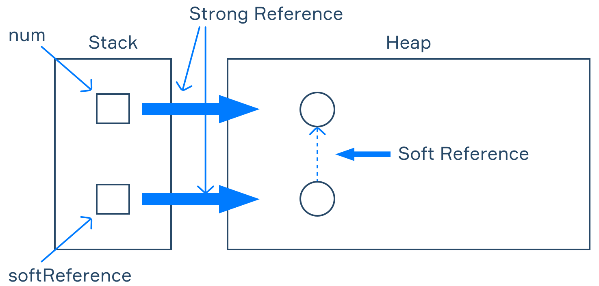

# Java 90 - 96

### Introduction to Logging 90

Logging - the act of recording during execution of an application. It gives information about events, like a message, timestamp, description, severity level. It could be user or system generated. Its outputted using a log file or standard output.

**Why?** Save time when troubleshooting - can find the exact moment an error occurred. Trace what used the program - find out where the requests came from (auditing). Monitor system operation - easier verification and reporting (profiling/statistics). Logs are meant to cover server issues, database issues, networking issues, errors from unanticipated user inputs, states of dynamically created objects, configuration values.

**Log types**

Debug - used to diagnose applications - inform us what the program is doing at a certain step and what it gets as a result of these actions.

Info - log important information about an application like log service start, service stop, configurations, assumptions.

Warn - first level of application failure, usually applied to log repeated attempts to access a resource, missing secondary data, or switching from a primary server to a back-up server.

Error - second level of application failures, more critical problems, usually affect the result of the operation but do not terminate the program.

Fatal - third level of application failures, used to indicate a much more serious error that causes the termination of the program, e.g. program failed and depending on the time and conditions of this failure the developers can find out how to fix the problem.

********************Log format******************** - `[date time][log level][message]`

Examples: `[2021-02-02 15:00:00] [INFO] User 'demo' has registered` `[2021-02-02 01:00:10] [ERROR] User 'alex98' cannot log in because the database is temporarily unavailable`

### Debugging Techniques 91

Debugging - the process of finding and fixing bugs in a program.

- logging/`printf()` : insert additional print statements in the code.
- assertions: a mechanism that monitors the program state, it terminates the program in a fail-fast manner when things go wrong. Fail-fast is an approach when errors that could otherwise be non-fatal are forced to cause an immediate failure, thus making them visible.
    
    First specifies the Boolean expression to be checked, and when it’s `false`, an error is thrown. The part after specifies the message that describes the error.
    
    Can also use assertions to check method preconditions and postconditions, that is conditions that must be met before or after a method is invoked. The assertion should not affect a program in any way other than throwing an error.
    
    **Invariants** are constraints that must be met for a program to function properly.
    
- Use a Debugger

```java
class Cat {
    String name;
    int age;
    public Cat(String name, int age) {
				assert (age >= 0) : "Invalid age";
        this.name = name;
        this.age = age;
    }
}
```

```java
assert (age++ >= 0) : "Invalid age"; //violates asseration rule
```

### Floating point types 92

A floating point numeral refers to the notation of a number which contains an integer part, a fractional part and their separator.

**floating-point types** represent such numbers: `float` and `double`. These types cannot represent an arbitrary decimal number, because they support only a limited number of significant decimal digits (6-7 for `float`, and 14-16 for `double`). 

- recommended to use doubles
- it’s possible to assign an integer to a double: `double one = 1;` `System.out.println(one); // 1.0`
- to declare and initialize a `float` variable, mark the assigned value with the special letter `f` (float literal): `float negValue = -0.15f;` `float pi = 3.1415f;`
- both can only store a limit number of decimal digits: `float f = 0.888888888888888888f;` `System.out.println(f); // 0.8888889`
- exponential floats: `double eps = 5e-3; // means 5 * 10^(-3) = 0.005` `double n = 0.01e2; // means 0.01 * 10^2 = 1.0`
- For `double` and `float` operands, the operator `/` performs a division, not an integer division : `System.out.println(squaredPi / 2); // 4.934511125`
    
    integer division : `double d1 = 5 / 4; // 1.0` real division: `double d2 = 5.0 / 4; // 1.25`
    
- Operations with floating-point numbers can produce an inaccurate result: `System.out.println(3.3 / 3); // prints 1.0999999999999999`
    
    Floats are stored and operated in binary form and not all real numbers can be represented exactly (similarly, we cannot represent the exact value of the 1/3 fraction in decimal form).
    

**Reading floating-point numbers** - `float f = scanner.nextFloat();`  `double d = scanner.nextDouble();`

### The Math Library 93

Functions:

- **`Math.min(..., ...)`** returns the smaller value of two arguments - `int min = Math.min(11, 81); // min is 11`
- **`Math.max(..., ...)`** returns the greater value of two arguments - `int max = Math.max(20, 30); // max is 30`
- **`Math.abs(...)`** returns the absolute value of its argument - `int abs = Math.abs(-10); // abs is 10` `double dabs = Math.abs(-10.33); // dabs is 10.33`
- `**Math.floor(...)**` returns the largest double value that is less than or equal to its argument and is equal to an integer - `double floor = Math.floor(3.78); // floor is 3.0`
- **`Math.ceil(...)`** returns the smallest double value that is greater than or equal to its argument and is equal to an integer - `double ceil = Math.ceil(4.15); // ceil is 5.0`
- **`Math.sqrt(...)`** returns the square root of its argument - `double sqrt = Math.sqrt(2); // sqrt is 1.4142...`
- **`Math.cbrt(...)`** returns the cube root of its argument - `double cbrt = Math.cbrt(27.0); // cbrt is 3.0`
- **`Math.pow(..., ...)`** returns the value of the first argument raised to the power of the second argument. `double cube = Math.pow(2, 3); // the cube of 2 is 8.0`
- **`Math.sin(...)`** returns the trigonometric sine of the given angle in radians - `double sin = Math.sin(pi / 2); // sin90°  is 1.0`
- **`Math.cos(...)`** returns the trigonometric cosine of the given angle in radians - `double cos = Math.cos(pi); // cos180° is -1.0`
- **`Math.toRadians(...)`** converts an angle measured in degrees to an angle measured in radians (approximately) - `double rad = Math.toRadians(30); // rad is 0.5235...`
- **`Math.random()`** returns a double value with a positive sign, greater than or equal to 0.0 and less than 1.0 - `double random = Math.random(); // a random value >= 0.0 and < 1.0`

Constants:

- **`Math.PI`** is the ratio of the circumference of a circle to its diameter - `double pi = Math.PI; // pi is 3.1415...`
- **`Math.E`** is the base of the natural logarithm - `double e = Math.E; // e is 2.71828...`

Example: Assume that we have a right triangle (one angle is 90 degrees). We know the lengths of both sides: a = 3 and b = 4. Calculate the length of the hypotenuse. 

```java
double a = 3, b = 4;
double c = Math.hypot(a, b); // c is 5.0
```

---

### Numeric Literals 94

There are three main types of numeric literals: Integer literals, Floating-point literals, Character literals.

Numeric literals also differ based on the numeral system of the values: there are decimal, hexadecimal, octal and binary literals. 

**Integer literals:** **int** and **long**. The default type of integer literals is int. `byte age = 46;` `short height = 165;` `int max = 2147483647;`

To store values that are greater than `Integer.MAX_VALUE`, use the `long` type, represented by long integer literals

- indicated by adding an `L` to the end of a literal: `long bigNum = 2147483648L;` `long smallNum = 5L;`
- cannot assign `long` literals to `int` variables: `int num = 5L; // error`
- the range of int literals is equal to the range of `int` values: `long tooBigInt = 2147483648; // error, too big integer literal`

Hexadecimal numbers consist of 16 digits: `0-9` and the letters `A-F`, case-insensitive, to represent `10-15`. To define hexadecimal numbers in Java, you have to add the `0x` prefix to the literal: `int hexValue1 = 0x29;` = 16^1 * 2 + 16^0 * 9 = 41 `int hexValue2 = 0x4B;` = 16^1 * 4 + 16^0 * 11 = 75 `int hexValue3 = 4B;` error, use the prefix!

Octal literals can have only digits from `0-7`. In Java, numeric literals with leading zeroes are octal numbers: `int octValue = 027;`= 8^1 * 2 + 8^0 * 7 = 23 `int decValue = 27;` = 27

Binary literals were introduced in Java 7. Use the `0b` prefix to define binary numbers in Java. `int binValue = 0b110110;` = 2^5*1 + 2^4*1 + 2^3*0 + 2^2*1 + 2^1*1 + 2^0*0 = 54

**Floating-point literals**: Simple floating-point literals consist of `0-9` digits, a decimal point, and an optional `F`, `f`, `D` or `d` suffix to indicate the type. If no suffix is specified, the type is assumed to be `double`. In case the fractional part is zero, the decimal point and zero may be omitted

```java
double num1 = 123.723; // a double literal 
float num2 = 34.0F;   // a float literal
float num3 = 0.05;    // error!
```

```java
.5F  // same as 0.5F
5F   // same as 5.0F
16.  // same as 16.0F
0.0  // zero
```

the power of 10 - The exponent is indicated by an `E` or `e` followed by a positive or negative decimal number:

```java
float num1 = 0.05e3F; // = 0.05 * 10^3 = 50
double num2 = 25.255e-4;  // = 25.255 * 10^(-4) = 0.0025255
```

```java
float hexFloat = 0x5.0p0f;   // 5.0 in hexadecimal form. Here 'f' indicates float
double hexDouble = 0xf.8p3; // 15.5 x 2^3 = 124.0 Here 'f' is part of number f.8
```

**Character literals** - in Java `char` is actually an integer type, that stores the 16-bit Unicode integer value of each character. `int characterLiteral = 'a';` = this is 97. The Unicode value of 'a' is `0x0061`, which is 97 in decimal. Note, that the numeric value of, for example, char '2' is 50.

You cannot use the underscore :

- at the beginning or end of the literal. For example, `_10` will be treated as an identifier instead of a numeric literal;
- adjacent to the decimal point, like in `10._025` or `20_.32`;
- before the `F` or `L` suffix. For example, `10002334_L` and `205_F` are incorrect.

You can also add an optional `+` or `-` sign to the beginning of numeric literals.

```java
-011  // octal for decimal -9
-5.2f // float -5.2
-.2   // double -0.2
-0x5C // hexadecimal for decimal -92
-'z'  // -122
```

### Garbage Collector 95

The heap memory is limited as it takes part of the physical memory (RAM) on the computer. So a program taking too much memory will eventually lead to crashes. Most programs have objects that at some point of the execution won't be used anymore, which means the memory may be freed and reused later. Some programming languages (for example, C or C++) require programmers to allocate and free memory manually.

The JVM utilizes **automated memory management**, which allows developers not to worry about memory while writing code and prevents possible programming mistakes. Memory is allocated in the JVM heap every time a program creates a new object and is freed using the garbage collection process.

**Garbage Collector** (or GC) - part of the JVM that frees up the memory in runtime for further use. To identify garbage, the JVM goes through all the objects and checks whether they are still reachable in the program. All objects that can't be reached from the program or from other reachable objects are considered "garbage", and the corresponding memory is freed up.

1. Determine which parts of memory the program no longer uses (i.e., "garbage")
2. Free these parts of memory. 
3. A compacting operation may be performed after the deletion step — all currently used objects are moved next to each other to free a big contiguous memory region and avoid fragmentation. 

**Generational garbage collection** algorithms consider additional information about objects, e.g. the time since the object was created. Most objects in programs are used only for a short time after creation. Thus, the garbage collector doesn't need to examine every object in the heap on every run and focuses mainly on recently created objects (the "younger generation"), which reduces the garbage collection time.

Garbage collection is performed automatically while a program is running. The JVM handles all the work including the decision when to run the GC. It may happen, for example, in fixed time intervals or when there is no free heap memory left. Programmers aren't supposed to run the garbage collector manually, and these calls don't even guarantee the GC invocation. 

In your programs, you may use the following ways to request the GC to perform the job:

- calling `System.gc()`;
- calling `Runtime.getRuntime().gc()`.

Example:

You can check the used memory size using `Runtime.getRuntime().totalMemory()` and `Runtime.getRuntime().freeMemory()`

1. Print the used memory information before performing any operations.
2. Create a bunch of new objects in a cycle for further use.
3. Print the used memory information after the objects' creation.
4. Perform the necessary operations (without creating new objects) so that the objects are no longer used in the code.

The value from step 3 will be greater than the value from step 1, since each new object takes some part of the available memory. After step 4, the objects become unreachable from the code and the memory may be freed up by calling `System.gc()` or `Runtime.getRuntime().gc()`. Printing the used memory information after the garbage collector invocation will show a value less than the value from step 3 if garbage collection was really performed.

### Types of References 96

**Strong Reference** - an object is not deleted from memory as long as it has at least one reference. 

As long as there is a reference to the object, it remains in memory. If there are no references, the object is available for deletion.

```java
public class ReferenceTypesDemo {
    public static void main(String[] args) {
        Integer num = 1995;
        num = null;

        System.out.println(num); // null    }
}
```

We have created an object to store a number that is referenced by a single `Integer` variable. 

Once we have assigned the `null` value to it, nothing references the object anymore. 

You will no longer have access to the object and the garbage collector will delete it when it considers it unnecessary.

This is the default reference type. If you haven't specified the reference type or haven't used a class that is implemented with a different type, the strong reference will be used by default.

**Soft Reference** - removed by GC only if the application is close to running out of memory and throws an `OutOfMemoryError`. To add a soft reference, you need to use the  `SoftReference`  class, passing the object that is intended to have the desired reference type to its constructor. It is the strongest among the non-strong references.

```java
public class ReferenceTypesDemo {
    public static void main(String[] args) {
        Integer num = 1995;
        SoftReference<Integer> softReference = new SoftReference<>(num);

        num = null;
        System.out.println(num); // null

        num = softReference.get();
        System.out.println(num); // 1995
    }
}
```

We have created two objects, the first for an `Integer`, and the second for a `SoftReference` that references an `Integer` object by a soft reference. 

For the first object, the term is **referent** and the other one is called **reference object**.

This technique allows you to get an `Integer` object even after its strong reference has been removed.



**Weak Reference** - weaker than a soft reference. While a soft reference allows the object to live until the application is almost out of memory, an object with only a weak reference can be removed during the first garbage collection after its creation.

```java
public class ReferenceTypesDemo {
    public static void main(String[] args) {
        Integer num = 1995;
        WeakReference<Integer> weakReference = new WeakReference<>(num);

        num = null;
        num = weakReference.get();

        System.out.println(num); // 1995    }
}
```

When we pass the `num` variable to the `WeakReference` constructor, the same thing happens in memory as in the case of a soft reference.

After the strong reference is removed from `num`, only the weak reference to the object remains, and it can be deleted at any moment.

If the object holds soft and weak references at the same time, it means that this object will survive garbage collections until the application runs out of memory.